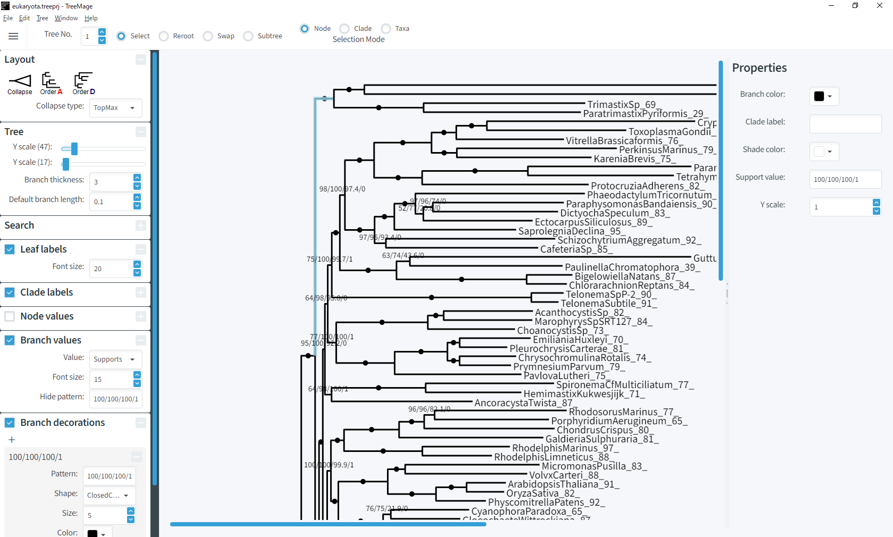

# TreeMage

GUI application for viewing phylogenetic trees and .NET library for processing phylogenetic tree.
TreeMage provides simple topology editing functions and drawing phylogenetic tree figures functions.

Detailed documents
- English - WIP
- [日本語](./docs/ja/README.md)

