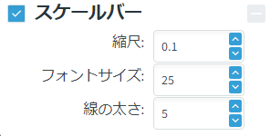

# クイックスタート <!-- omit in toc -->

- [ツリーの読み込み](#ツリーの読み込み)
- [樹形操作](#樹形操作)
  - [Select](#select)
  - [Reroot](#reroot)
  - [Swap](#swap)
  - [Subtree](#subtree)
- [表示メニュー](#表示メニュー)
  - [レイアウト](#レイアウト)
  - [ツリー](#ツリー)
  - [検索](#検索)
  - [系統名](#系統名)
  - [Clade labels](#clade-labels)
  - [結節点の値](#結節点の値)
  - [枝の値](#枝の値)
  - [枝の装飾](#枝の装飾)
  - [スケールバー](#スケールバー)
- [プロジェクトファイルの管理](#プロジェクトファイルの管理)
- [エクスポート](#エクスポート)

## ツリーの読み込み

メニューからの読み込みかファイルマネージャーからのdrag & dropでツリーを読み込むことができます。
メニューではFile→Import→Newickから読み込むことができます。

> [!IMPORTANT]
> 現段階ではNewickフォーマットのみ受け付けています。
> Nexus等の他フォーマットは今後実装予定です。

## 樹形操作

画面上部から編集モードを選択することができます。

- Select: リーフや枝を選択して編集することができます
- Reroot: リルートを行います
- Swap: 枝の入れ替えを行います
- Subtree: サブツリーを抜き出します

### Select

デフォルトのモードです。
枝やリーフの選択時に画面右のプロパティウィンドウで枝色などの情報を編集できます。

### Reroot

白抜き四角（枝中）または黒塗り四角（結節点）をクリックすることでリルートすることができます。
白抜き四角をクリックするとrootedに、黒塗り四角をクリックするとunrootedな形でリルートできます。

### Swap

結節点の黒塗り四角を選択すると上下の枝を交換できます。

### Subtree

枝中の黒塗り四角を選択するとその枝から先を新たなツリーとして抜き出します。

以下が選択後のツリー

## 表示メニュー

画面左のサイドバーから表示内容をカスタマイズすることができます。

### レイアウト

ツリー全体の表示方法について編集できます。
- Collapseボタン：枝選択時に押すと、選択中の枝を折りたたんで三角形の表示に変えられます。折りたたみ中の枝を選択中にもう一度押すと折りたたみを解除します
- OrderAボタン：枝の長さの昇順で枝の順番を並び替えます
- OrderDボタン：枝の長さの降順で枝の順番を並び替えます
- 折りたたみタイプ：折りたたみの表示を変更します
  - TopMax：右上の頂点が最大の枝長に、右下の頂点が最小の枝長に対応します
  - BottomMax：右上の頂点が最小の枝長に、右下の頂点が最大の枝長に対応します
  - AllMax：右側の両頂点が最大の枝長に対応します
  - Constant：右側の両頂点が直下にある「横幅」の枝長換算で配置されます

### ツリー

ツリーの一般的な設定を編集できます。
- X拡大率：横方向の拡大率
- Y拡大率：縦方向の拡大率
- 枝の太さ：描画される枝の太さ
- デフォルトの枝長：枝長が未指定の場合に利用する枝長のダミー値

> [!TIP]
> X・Y拡大率のスライダーは、フォーカスした状態下では→キー・←キーで1ずつ微調整できます。

### 検索

条件にマッチする系統を検索します。
- テキストボックス：検索文字列を入力します
- 虫眼鏡マーク：クリックで検索を行います
- 検索対象：検索対象を選択します
  - Taxon：リーフ名
  - Supports：サポート値
- 大/小文字の無視：チェックを入れると大文字/小文字の区別を無視します
- 正規表現を使用：チェックを入れると正規表現で検索を行います

### 系統名

リーフの表示を設定します。
- タイトル横のチェックボックス：表示の有無
- フォントサイズ：リーフのフォントサイズ

### Clade labels

クレード名の表示を設定します。
- タイトル横のチェックボックス：表示の有無
- フォントサイズ：クレード名のフォントサイズ
- 線の太さ：クレード範囲を表す直線の太さ

### 結節点の値

結節点の横の値の表示を設定します。

- タイトル横のチェックボックス：表示の有無
- 表示値: 表示する値を選択
  - Supports：サポート値
  - BranchLength：枝長
- フォントサイズ：結節点の値のフォントサイズ

### 枝の値

枝の上に表示する値の表示を設定します。

- タイトル横のチェックボックス：表示の有無
- 表示値: 表示する値を選択
  - Supports：サポート値
  - BranchLength：枝長
- フォントサイズ：枝の値のフォントサイズ
- 非表示パターン：指定した正規表現にマッチする値を非表示にします

> [!TIP]
> 非表示パターンの正規表現の例
> - `BP` が100である枝を非表示にしたい場合： `^100$`
> - `UFBP/BP` のうち、UFBP≧95＆BP≧90を非表示にしたい場合： `^(9[5-9]|100)/(9\d|100)$`

### 枝の装飾

枝の装飾の表示を設定します。

- タイトル横のチェックボックス：表示の有無
- +ボタン：新たな装飾の設定を追加します。
- 装飾ごとの設定事項
  - パターン：装飾を行う枝の値の条件（正規表現）
  - 図形：装飾の図形を選択します
    - Closed Circle：塗りつぶされた円
    - Open Circle：白抜きの円
    - Closed Rectangle：塗りつぶされた正方形
    - Open Rectangle：白抜きの正方形
  - サイズ：装飾のサイズ
  - 色：装飾の色
  - 目のボタン：表示/非表示を切り替えます
  - 赤いゴミ箱ボタン：設定を削除します

### スケールバー

スケールバーの表示を設定します。

- タイトル横のチェックボックス：表示の有無
- 縮尺: スケールバーとして表示する枝長の値
- フォントサイズ：枝長のフォントサイズ
- 線の太さ：バー部分の太さ

## プロジェクトファイルの管理
メニューのFile→SaveまたはCtrl+Sでこれまでの編集状況を、プロジェクトファイルとして保存することができます。
プロジェクトファイルは `.treeprj` の拡張子で表され、TreeMage独自のフォーマットとなっています。

> [!TIP]
> TREEPRJファイルの実体はJSONファイルをGZIP形式に圧縮したものとなっています。
> 自己責任とはなりますが、JSONファイルを編集してGZIP化することでTreeMage外で編集状況をいじることも可能です。

一度保存したプロジェクトファイルはメニューのFile→OpenまたはCtrl+O、ファイルマネージャーからのdrag & dropで読み込むことができます。

## エクスポート
TreeMageは編集した系統樹を、ツリーのファイルとしても、画像としても出力することができます。
メニューのFile→Exportからフォーマットを選択できます。
以下がサポートしているフォーマットです。

- Tree/Newick：Newickフォーマット（色などのスタイルの情報は保存できません）
- PNG
- SVG
- PDF

> [!IMPORTANT]
> 現状、PDF出力は技術的問題からレイヤー分け・グルーピングができていません。
> Adobe Illustrator等で編集を行いたい場合は**SVGとして出力**してから開くことを強く推奨します。
